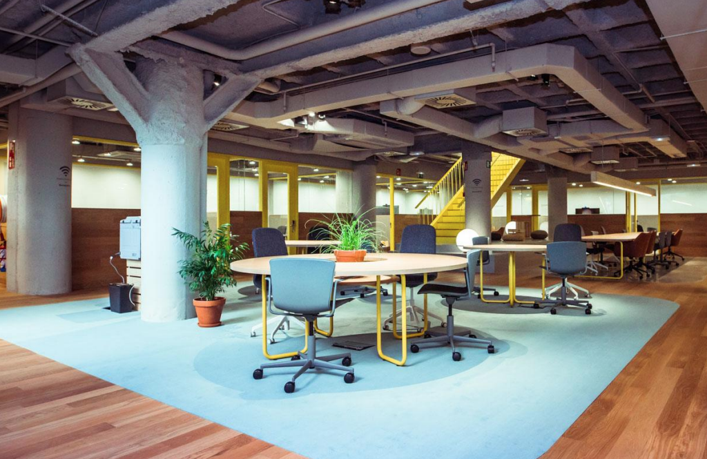
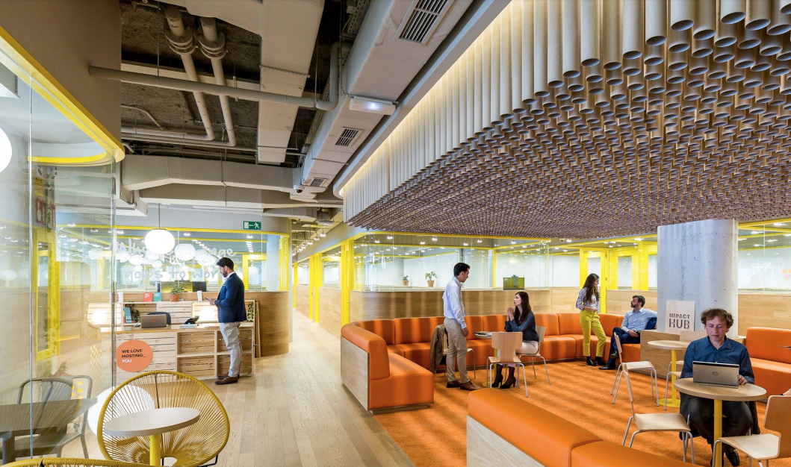
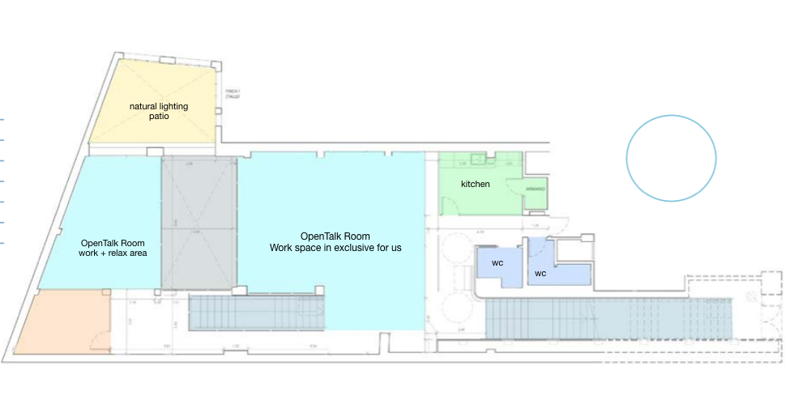
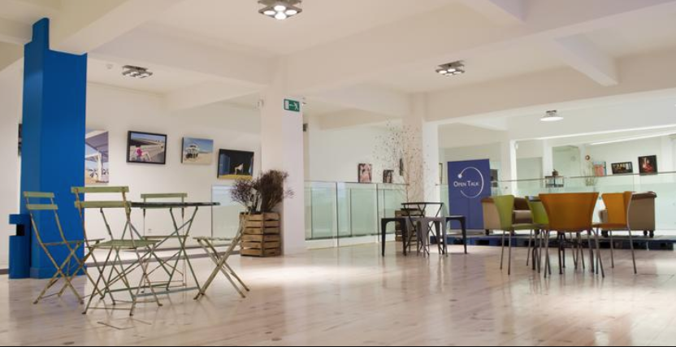
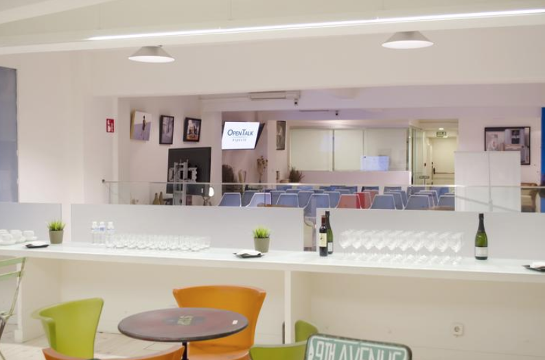
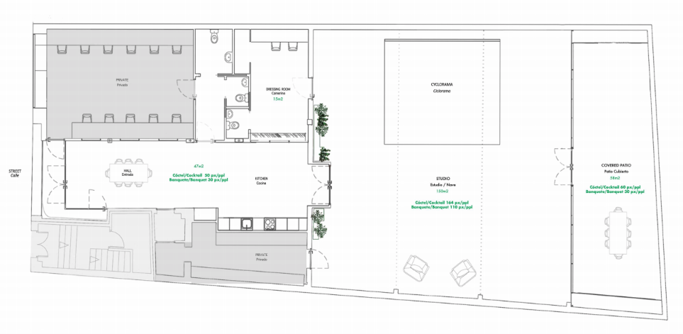
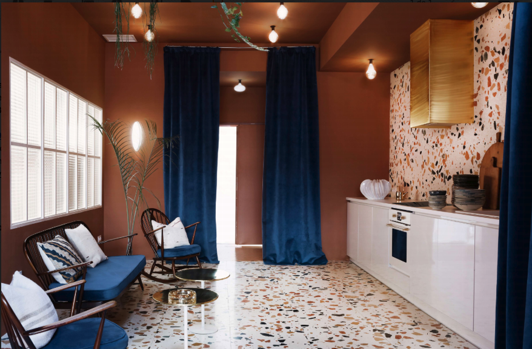
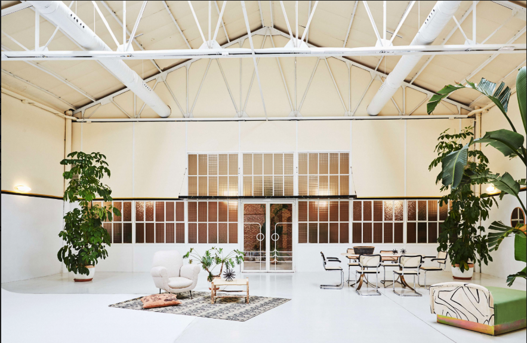
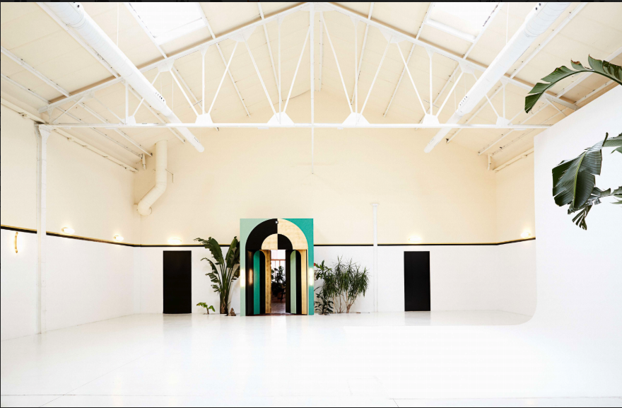

<script> 
    $(document).ready(function() { 
    $head = $('#header'); 
    $head.prepend('<A href = https://www.cuttingedge-events.com></A>') 
    }); 
</script> 

```{r setup, include=FALSE}
knitr::opts_chunk$set(echo = FALSE, message=FALSE, warning=FALSE)
```


```{r libraries}
library(readxl)
library(shiny)
library(dplyr)
library(knitr)
library(timevis)

```
## Map 

<iframe src="https://www.google.com/maps/d/embed?mid=15zJcGckD6qgiW1Dy3dSboezB4NcnhMis&hl=es" width="100%" height="500"></iframe>

<hr>

## Suggested Apartments {.tabset .tabset-fade .tabset-pills}

### _**Eric Vökel boutique apartments**_
 
Eric Vökel Madrid suites and Eric vökel Atocha suites are both two apartments buildings located in Madrid. These apartments belongs to a  company hosted in different European countries. They feature a high standing apartment complex.
All 70 guests will be distributed in both buildings, which are 20 minutes by walk/ 10 minutes by car each other. 

Rates include:
* Reception care service from 09:00-18:00
* WiFi
* Keys for all guests (card format)
* Water and electricity
* Apartment instalations: kitchen, fridge, ovan, washing machine, all the stuff needed to cook, dishwasher, usual cleaning material (broom, mop...)
* All common zones: Terrace on the athic, Climatized pool on the low level, parking, Eric's corner (free coffee, tea,, oil, etc)
* Towels
* Cleaning each 3 days

Rates doesen't include:
* Bar (neither bar nor restaurant available on the building)

<br>
**Each guests will have his own room, but the bathrooms will be shared with all guests in the apartment (1 bathroom or 2, depending on the apartment)**

<br>

#### **Eric Vökel Madrid suites**

Located in San Bernardo street, Eric Vökel Madrid Suites is a gorgeous and incredibly refurbished property which includes beautiful apartments. Located in the heart of the Malasaña district, next to the Gran Vía, it allows guests to experience and enjoy a more pure, authentic Madrid. This central district, now the height of fashion, has great public transportation links that make it incredibly easy to get to any point of the city.

The building is also just a ten minute walk from the Puerta del Sol, Plaza de España and the Prado Museum.

Eric Vökel Madrid suites features capacity up to 44 people. It has different types of rooms:

* 8x Apartments, 2 Bedrooms + 1 bed-sofa, 1 Bathroom (2 guests per apartment)
* 9x Apartments, 2 Bedrooms + 1 bed-sofa, 2 Bathrooms (2 guests per apartment) 
* 2x Attic apartments, 2 Bedrooms + 1 bed-sofa, 1 Bathroom (2 guests per apartment)
* 1x Apartment, 3 Bedrooms + 1 bed-sofa, 2 Bathrooms (3 guests)
* 1x Attic apartment, 3 Bedrooms + 1 bed-sofa, 2 Bathrooms (3 guests)

* *Each guest will has his own room*


<br>

#### **Eric Vökel Atocha suites**

Located in Calle Vizcaya, Eric Vökel Atocha suites were completely refurbished in 2013, stand out thanks to their unique location. They are located right at center of the Golden Triangle of Art, just a few minutes away from the Prado Museum, the Reina Sofía museum and the Retiro Park. 

Additionally, the Atocha metro station makes sure that guests are connected to every place of this fantastic city: the Plaza Mayor, the Puerta del Sol, the Gran Vía. And on top of that, the property offers free Jacuzzi and parking access.

Eric Vökel Atocha suites features capacity up to 35 people. As well as Eric Vökel Madrid suites It has different types of rooms:

* 8x Apartments, 1 Bedroom + 1 bed sofa, 1 Bathroom (individual apartment)
* 5x Apartments, 1 Bedroom + 1 bed-sofa, 1 Bathroom, terrace (individual apartment)
* 3x Apartments, 2 Bedrooms + 1 bed-sofa, 1 Bathrooms (2 guests)
* 8x Apartment, 2 Bedrooms + 1 bed-sofa, 2 Bathrooms (2 guests)

* *Each guest will has his own room*


### _**Smart Collection Gran Via Capital**_

SmartRentalCollection Gran Vía Capital is located right in Madrid's Gran Vía, one of the most important commercial streets, close to the main point of interest such as Puerta del Sol, Plaza Mayor, Palacio Real... The apartments are fully furnished and equipped for you to make the most out of your stay in Madrid, and feel like at home. They also feature a 24/7 Front Desk, a seasonal pool, sauna, solarium on the rooftop, gym and parking.

All guests will be accomodated in the same building. There are two types of apartments, the individual ones and double ones. All guests will have his own room though.

* 30x Apartments, 1 Bedroom and 1 Bathroom (1 guest)
* 20x Apartments, 2 Bedrooms and 2 Barhrooms (2 guests)

*Each guests will has his own room*


<br>

## Working Spaces {.tabset .tabset-fade .tabset-pills}

We are suggesting different venues but all of them are following the same idea: We think that what the group needs is a open and flexible space with a kitchen, toilets, natural lighting and wifi. Then, in some of them we will need to rent the furnuture acording with your client needs and preferences.

Following you will see some options, you can see the location in the map above and the rates on the budget below:
<br>

### Impacthub Prosperidad

Impacthub is a co-working company, they have 5 buildings in Madrid and in January 2020 they will open a new one: **ImpactHub Prosperidad**

It is an industrial buildind totally renewed where you can find spacious work-spaces, small and private offices, shared chill-out areas, a shared kitchen (with microwave, fridge, coffee machine, etc)

Our group will have:

  * A work space (furniture included) in exclusive for them and access to the shared areas
  * Access 24/7
  * 80 hours of free rental of small meeting rooms (until 6 pax) in any of the 6 ImpactHub buildings (under availability)
  * App to book a meetingroom 
  * WIFI
  * Security and cleaning services 

The pictures below are from the ImpactHub Picasso, but ImpactHub Prosperidad will have a similar atmosphere.




 


<br>


### OpenTalk 

OpenTalk has different offices and meeting rooms, what we suggest id the OpenTalk room. It is an open space with daylight, with a second smaller space just next to it. The idea would be to set a work space in the main room and a more relaxed area in the smaller one.
In the same floor they will have access to the kitchen and to the toilets.

The other meeting rooms can be rented by other guests, as we won't have the whole space in exclusive.






<br>


### Espacio Nueva Carolina

Nueva Carolina is a clean and spacious venue. Our group will have the space in exclusive, it has bautiful daylight and a big kitchen. The space has its own furniture but there are 4 sofas, 8 chairs, 4 tables, so, we will need to rent the office furinure.

There will be always one person from the company to assist and the access will be from 8.00h to 00.00h 









<br>


### Espacio Muelle 36

<iframe src="Muelle36/muellefotos.html"  frameborder="0" width="100%" height="1100" scrolling="no"></iframe>
<br>


## Restaurant Options {.tabset .tabset-fade .tabset-pills}

### Ana La Santa 

<iframe src="AnaLaSanta/AnaLaSanta.html"  frameborder="0" width="100%" height="1100" scrolling="no"></iframe>

<br>

### La Mucca del Prado

<iframe src="LaMuccadePrado/LaMuccadePrado.html"  frameborder="0" width="100%" height="1100" scrolling="no"></iframe>

<br>

### Cafe de Oriente 

<iframe src="CafedeOriente/CafedeOriente.html"  frameborder="0" width="100%" height="1100" scrolling="no"></iframe>

<br>

### Habanera

<iframe src="Habanera/Habanera.html"  frameborder="0" width="100%" height="1100" scrolling="no"></iframe>

<br>

### Nubel

<iframe src="Nubel/Nubel.html"  frameborder="0" width="100%" height="1500" scrolling="no"></iframe>

<br>


### Canalla Bistró (Platea Madrid)


<iframe src="PlateaMadridCanallaBistro/CanallaBistro.html"  frameborder="0" width="100%" height="1100" scrolling="no"></iframe>

<br>


## Budget 

<iframe src="https://relocationmadbudget.netlify.com/"  frameborder="0" width="100%" height="2800" scrolling="no"></iframe>

<br>

*****

## Terms & Conditions

  * Rates valid for 2020.
  
  * Net rates for Ciceron
  
  * Cutting Edge Events management fee including in the detailed rates
  
  * VAT included. 
  
  * No reservation has been done. Availability upon request.
  
*****


